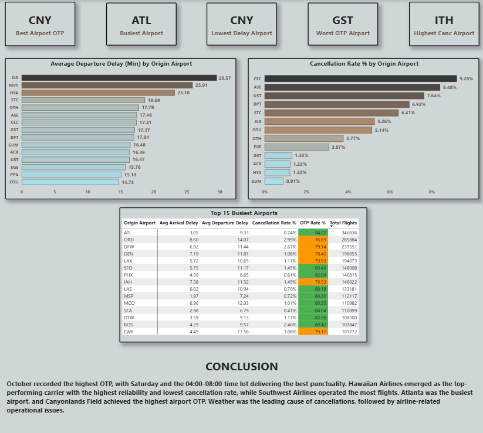

# U.S. Airline Performance & Delay Analysis

End-to-end data analytics project analysing 5.8 million U.S. domestic flight records from 2015 to identify delay patterns, cancellation trends, airline performance rankings, and airport congestion hotspots.

Built using PostgreSQL and SQL for data processing and analysis, and Power BI for interactive dashboard reporting.

---

## Business Problem

The U.S. airline industry faces persistent punctuality challenges that cost airlines millions in operational recovery and damage passenger trust. This project identifies the root causes of delays and cancellations, ranks airline and airport performance across 14 carriers and 322 airports, and delivers actionable recommendations for operations teams.

---

## Tools and Technologies

| Tool | Purpose |
|---|---|
| PostgreSQL | Data storage, cleaning, transformation, and KPI development |
| SQL | Exploratory analysis, view creation, and analytical queries |
| Power BI | Four-page interactive dashboard |
| DAX | Calculated measures and KPIs |
| Excel | Initial data inspection and validation |

---

## Dataset

- Source: U.S. Department of Transportation (2015)
- Size: 5,819,079 flight records
- Airlines: 14 carriers
- Airports: 322 U.S. airports
- Key view: vw_flight_analysis — consolidated view joining flights, airlines, and airports into a single analytical table

---

## Dashboard Pages

| Page | Description |
|---|---|
| Executive Overview | Industry KPIs, top delayed airports, cancellation by type, OTP by month and airline |
| Airline Analysis | Airline slicer, cancellation rate, OTP ranking, performance scorecard, delay by airline |
| Time Analysis | Best and worst month and day, OTP by day, cancellation by day, flights by time slot |
| Conclusion | Airport summary cards, departure delay by airport, cancellation by airport, airport scorecard |

---

## Dashboard Screenshots

### Executive Overview

### Airline Analysis

### Time Analysis

### Conclusion

---

## Key Findings

- Industry OTP is 82.14% with an average arrival delay of 4.41 minutes
- Hawaiian Airlines leads at 89.47% OTP and Spirit Air Lines trails at 71.25%
- October is the best month and June the worst at 9.60 minutes average delay
- Saturday has the best OTP at 84.67% and Monday has the highest cancellation rate at 2.43%
- Weather drives 54.35% of cancellations but carrier issues account for 28.11%
- Atlanta is the busiest airport and Chicago O'Hare is the most congested major hub
- The 08:00 to 12:00 window carries the highest flight volume at 1.46 million departures

---

## SQL Highlights

- Added flight_date as a proper DATE column using MAKE_DATE for time intelligence
- Added cancellation_reason_desc to convert A, B, C, D codes into readable labels
- Created vw_flight_analysis, a consolidated view joining all three tables
- Used window functions, RANK(), CASE WHEN, COALESCE(), and NULLIF() throughout
- All KPI queries written and validated in PostgreSQL before connecting to Power BI

---

## Business Recommendations

- Add schedule buffers on chronically delayed routes to improve reported OTP
- Reduce the 28% carrier-driven cancellation share through better maintenance planning
- Rebalance peak hour scheduling at ORD, DFW, and EWR to reduce congestion
- Treat June and July as high-risk operational periods with dedicated staffing plans
- Position spare aircraft and crew at major hubs on Sunday evenings to reduce Monday cancellations

---

## How to Run

1. Install PostgreSQL and pgAdmin
2. Create a database called airline_performance
3. Run US_Airline_Analysis.sql to create tables, views, and KPI queries
4. Open Power BI Desktop and connect to PostgreSQL on localhost
5. Load vw_flight_analysis as the data source
6. Open US_Airline_Performance_Analysis.pbix

---

## Author

Raju Kumar S
Data Analyst, Bengaluru, India

- LinkedIn: [linkedin.com/in/rajukumarsahani](https://linkedin.com/in/rajukumarsahani)
- GitHub: [github.com/RajuKumar31](https://github.com/RajuKumar31)
- Portfolio: [rajukumar31.github.io](https://rajukumar31.github.io)
